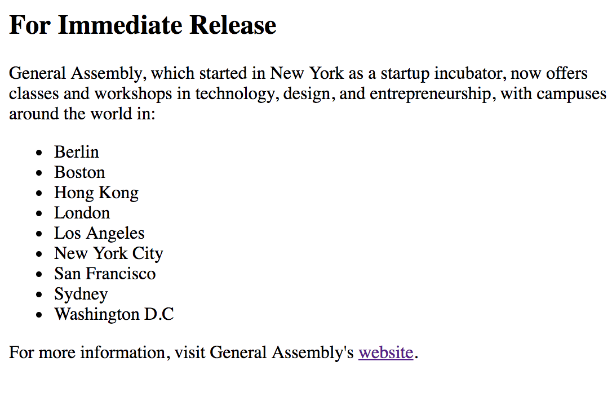
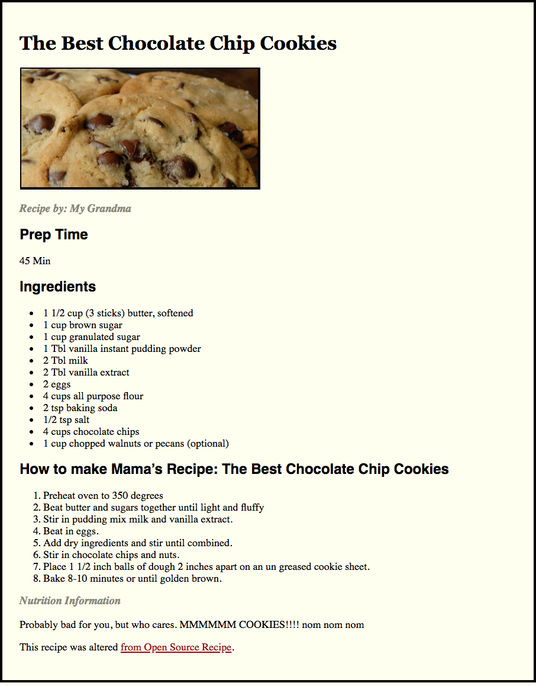

# FEWD - HTML BASICS

---


## Agenda

*	HTML Tags & CSS Selectors Review
*	Structure Reading w/ Understanding
*	External Style Sheets
*	Lab Time

---


## HTML Tags & CSS Selectors Review


---


## HTML Basics

---


## HTML vs HTML5

HTML5 is HTML with a few additions
The Doctype tells you if the page is HTML5 ready.


```<!DOCTYPE html>```


## HTML HISTORY


Note:
image retrieved from http://www.onbile.com/info/wp-content/uploads/2013/09/Timeline-of-web-technologies-639x168.jpg on October 1, 2013.

---


## HTML Syntax


---

## HTML Syntax


---

## Content Tags

Heading Elements

```html
<h1>Largest Heading</h1>
```

```html
<h2> . . . </h2>
```

```html
<h3> . . . </h3>
```

```html
<h4> . . .</h4>
```

```html
<h5> . . . </h5>
```

```html
<h6>Smallest Heading</h6>
```

---

## Content Tags

Text Elements

```html
<p>This is a paragraph</p>
```

```html
<code>This is some computer code</code>
```

---

## Content Tags

Unordered list
```html
<ul>
</ul>
```

---

## Content Tags

Unordered list item
```html
  <li>First item</li>
  <li>Next item</li>
```

## Content Tags

Ordered list with list items
```html
<ol>
  <li>First item</li>
  <li>Next item</li>
</ol>
```
---

## Content Tags

links
 ```html
 <a href="www.google.com">First item</a>
 ```


---


## General Assembly Press Release


---


## External Style Sheets

---


## Cookie Recipe



---

## Homework

*	Create a resume website
*	Watch a video on the Internet about the Internet
*	Read about CSS Colors

---
